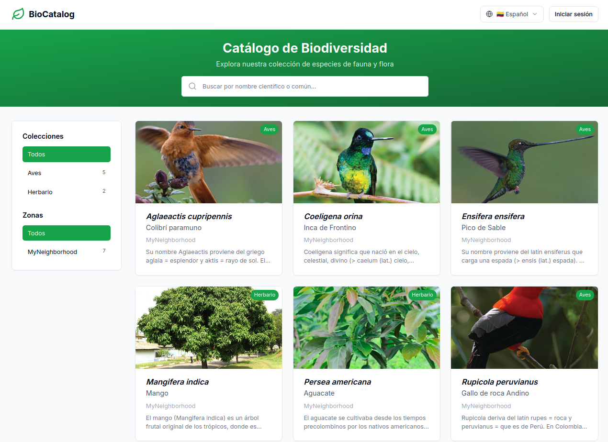
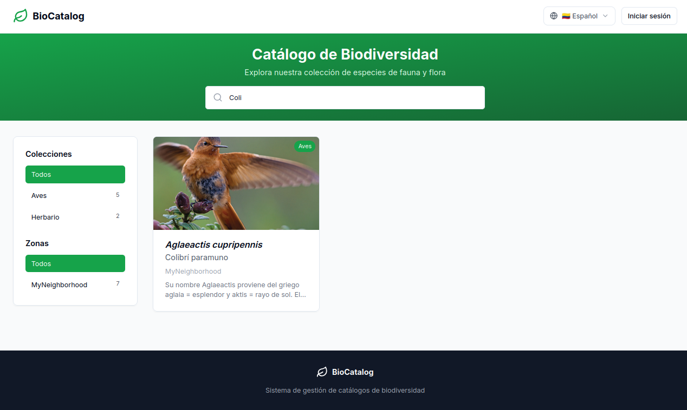
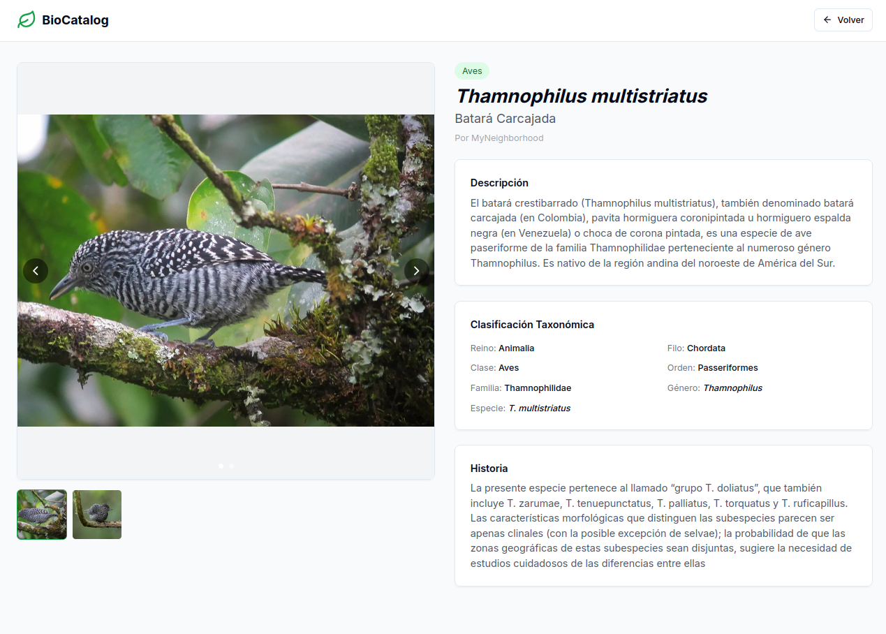
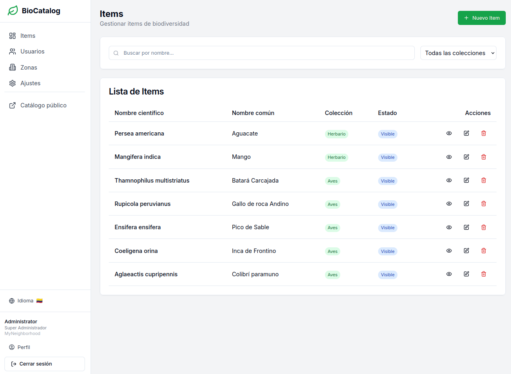
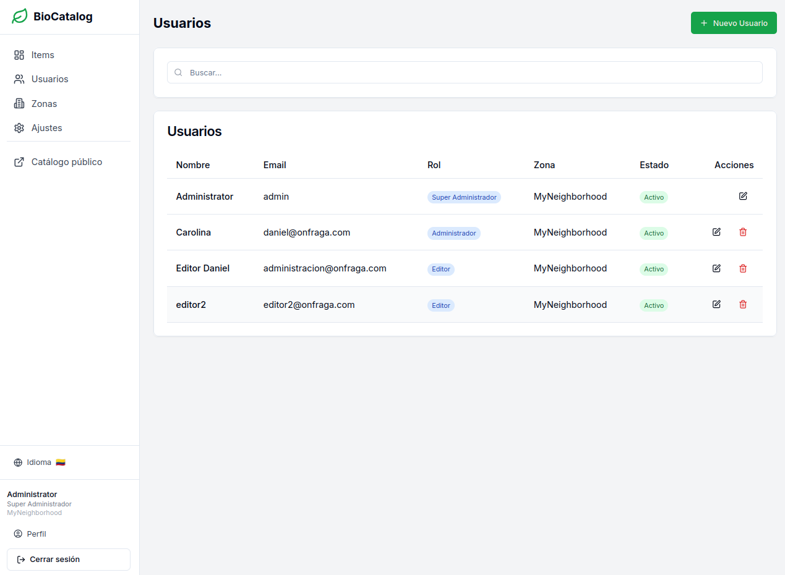
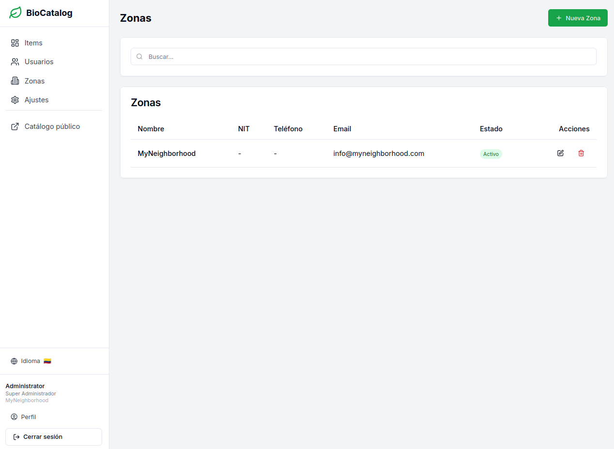
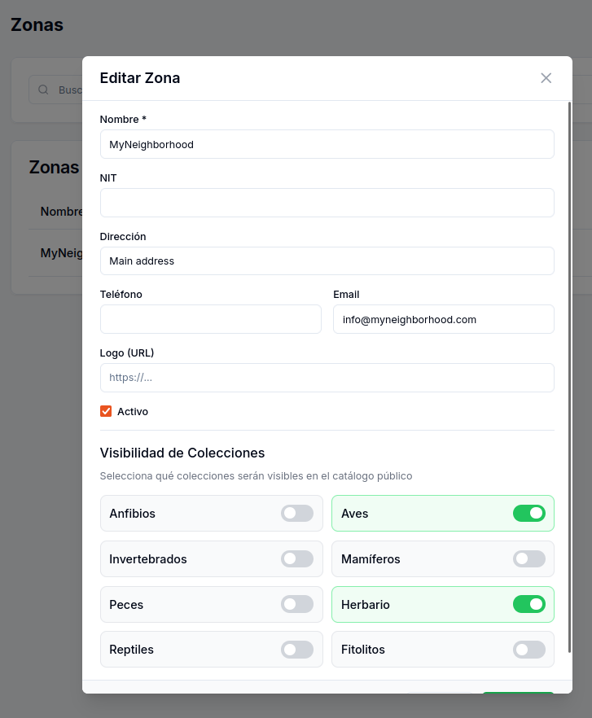
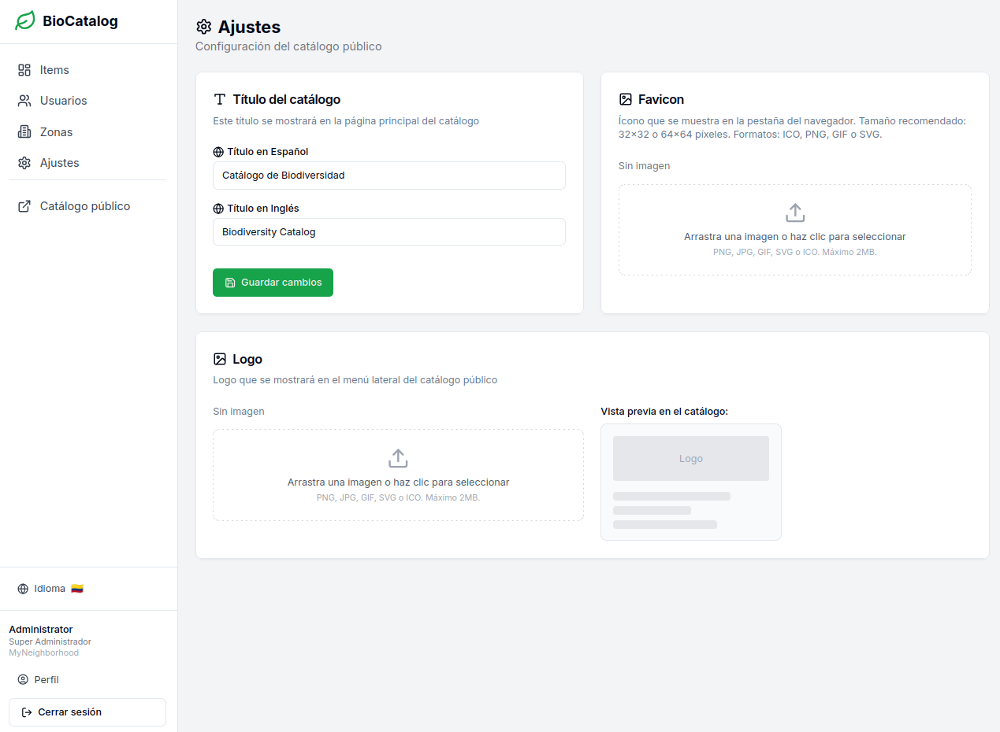

# BioCatalog



**BioCatalog** is a biodiversity catalog management system that allows documenting, organizing, and sharing information about fauna and flora species.

The public catalog's main page presents an intuitive interface with:

- **Green header** with the title "Biodiversity Catalog" and a central search bar
- **Left sidebar** with filters by Collections (Birds, Herbarium) and Zones
- **Card grid** displaying registered species, each with:
  - Representative image of the species
  - Collection label (Birds, Herbarium, etc.)
  - Scientific name in italic format
  - Common name
  - Brief description
- **Language selector** (Spanish/English) in the top right corner
- **Access to administration area** via the "Login" button

---

## Search and Filtering

<a href="docs/img/BioCatalogoHome-search.png">
  
</a>

*Click on the image to view full size*

The catalog offers powerful search and filtering tools:

- **Search bar**: Allows searching species by scientific or common name. In the example, searching for "Coli" automatically filters showing the "Colibrí paramuno" (*Aglaeactis cupripennis*)
- **Filter by Collections**: Select from categories like Birds (5 species), Herbarium (2 species), etc.
- **Filter by Zones**: Filter by geographic location or institution (e.g., MyNeighborhood)
- **Real-time results**: Results update instantly as you type

---

## Species Detail

<a href="docs/img/BioCatalogoDescItem.png">
  
</a>

*Click on the image to view full size*

Clicking on any species in the catalog opens its detailed information page including:

- **Main image**: High-quality photograph of the species
- **Collection label**: Indicates which collection it belongs to (Birds, Herbarium, etc.)
- **Scientific name**: *Thamnophilus multistriatus* (in italic format)
- **Common name**: Batará Carcajada (Bar-crested Antshrike)
- **Description**: Detailed text about the species, its characteristics and habitat
- **Taxonomic Classification**: Table with scientific information:
  - Order: Chiroptera
  - Class: Birds
  - Family: Thamnophilidae
  - Genus: Thamnophilus
  - Species: T. multistriatus
- **History**: Additional information about the name's origin, distinctive morphological characteristics, and scientific data of interest

---

## User Zone

The administration panel allows managing all aspects of the catalog. Only authenticated users can access these features.

### Items Management

<a href="docs/img/Dashboard-items.png">
  
</a>

*Click on the image to view full size*

The **Items** section allows managing all species in the catalog:

- **Tabular list** with columns: Scientific name, Common name, Collection, Status, and Actions
- **Search box** to quickly locate species
- **Filter by collection** to view only items from a specific category
- **Status**: Indicates if the item is "Visible" in the public catalog
- **Available actions**:
  - View item detail
  - Edit information
  - Delete item
- **"+ New Item" button** to add new species to the catalog

---

### User Management

<a href="docs/img/Dashboard-users.png">
  
</a>

*Click on the image to view full size*

The **Users** section allows managing system access:

- **User list** with: Name, Email, Role, Assigned Zone, and Status
- **Available roles**:
  - **Super Administrator**: Full system access
  - **Administrator**: Complete management of their zone
  - **Editor**: Can create and edit items
- **Status**: Active/Inactive to control access
- **Assigned zone**: Each user belongs to a specific zone
- **Actions**: Edit and delete users
- **"+ New User" button** to register new users

---

### Zones and Collections Management

<a href="docs/img/Dashboard-zonas.png">
  
</a>

*Click on the image to view full size*

**Zones** represent organizations, institutions, or geographic areas:

- **Zone information**: Name, Tax ID, Phone, Email, and Status
- **Each zone** can have its own species catalog
- **Multi-tenant**: The system supports multiple independent organizations

<a href="docs/img/Dashboard-zonas-collecciones.png">
  
</a>

*Click on the image to view full size*

When editing a zone, you can configure:

- **Basic data**: Name, Tax ID, Address, Phone, Email
- **Custom logo**: Organization's logo URL
- **Status**: Active/Inactive
- **Collections Visibility**: Select which collections will be available in that zone's public catalog:
  - Amphibians, Birds, Invertebrates, Mammals, Fish, Reptiles, Herbarium, Phytoliths

---

### Catalog Configuration

<a href="docs/img/Dashboard-config.png">
  
</a>

*Click on the image to view full size*

The **Settings** section allows customizing the public catalog's appearance:

- **Catalog title**:
  - Spanish title: "Catálogo de Biodiversidad"
  - English title: "Biodiversity Catalog"
- **Favicon**: Icon displayed in the browser tab (32x32 or 64x64 pixels, ICO, PNG, GIF, or SVG formats)
- **Logo**: Image displayed in the public catalog's sidebar
- **Preview**: Shows how the logo will appear in the catalog

---

## Technologies

- **Backend**: Laravel 11 (PHP 8.2+)
- **Frontend**: Next.js 14 + React 18
- **Database**: MySQL 8
- **UI**: Tailwind CSS + shadcn/ui
- **Containers**: Docker & Docker Compose

## Docker Installation

```bash
# Clone the repository
git clone https://github.com/your-username/BioCatalog.git
cd BioCatalog

# Start with Docker
docker compose up -d --build

# Access the application
# Frontend: http://localhost:3000
# Backend API: http://localhost:8000
```

## Manual Installation

### Backend (Laravel)

```bash
cd backend
composer install
cp .env.example .env
php artisan key:generate
php artisan migrate --seed
php artisan serve
```

### Frontend (Next.js)

```bash
cd frontend
npm install
npm run dev
```

## Default User

```
Username: admin
Password: admin123
Role: Super Administrator
```

## Available Collections

1. Amphibians
2. Birds
3. Invertebrates
4. Mammals
5. Fish
6. Herbarium
7. Reptiles
8. Phytoliths

## License

MIT
